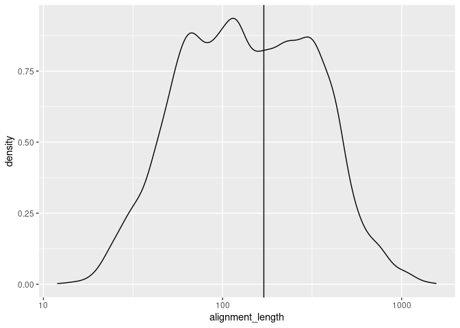
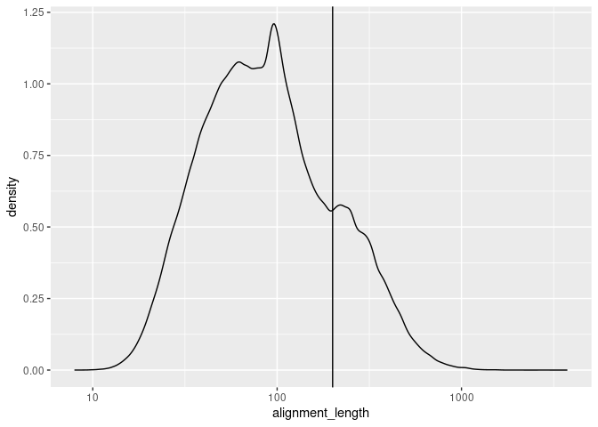
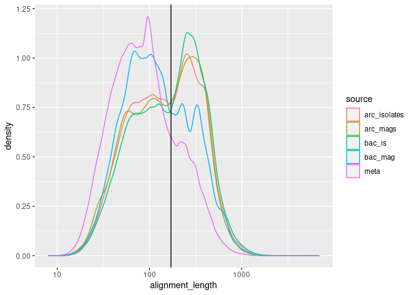

Example analysis for Kaelyn’s Big Blast project
================

# Notes on the setup of the big\_blast directory

  - I will add these notes this weekend

# Tasks for Kaelyn

1.  Find the approximate cutoff of bases, below which we should exclude
    1.  Read each .csv of BLAST “top hits” into R, using `read_csv()`
    2.  *randomly* subsample each of those data frames down to about
        1000 entries or so (this will make it way easier to deal with
        the data sets, because the full datasets are huge)
    3.  “bind” those data frames together to create a single data frame,
        with a row for each sequence an a column for each column in the
        original data frame, plus a column identifying the data source
        (e.g. Metagenomes, Archaeal SAGs, etc)
    4.  Make a density plot using `ggplot()` and `geom_density()` of all
        of those sequence lengths, colored by data source
2.  For each .csv file of top hits, filter out the sequences shorter
    than your cutoff, using `filter()`

<!-- end list -->

``` r
library(dplyr)
library(tibble)
library(ggplot2)
library(readr)
```

Read an example dataset and figure out where the division between
“short” and “long” reads is.

``` r
arc_is <- read_csv("/srv/data/big_blast/results/JGI_arc_isolates_top_bitscores.csv")
arc_mags <- read_csv("/srv/data/big_blast/results/JGI_arc_mags_top_bitscores.csv")
bac_is <- read_csv("/srv/data/big_blast/results/JGI_bac_isolates_top_bitscores.csv")
bac_mag <- read_csv("/srv/data/big_blast/results/JGI_bac_mags_top_bitscores.csv")
sags <- read_csv("/srv/data/big_blast/results/JGI_SAGs_top_bitscore.csv")
sag <- read_csv("/srv/data/big_blast/results/JGI_SAGs_top_bitscores.csv")
meta <- read_csv("/srv/data/big_blast/results/Metagenomes_top_bitscores.csv")

p_arc_is <- ggplot(arc_is, aes(x=alignment_length)) + 
  geom_density() + 
  geom_vline(xintercept = 170)+
  scale_x_log10()
print(p_arc_is)
```

<!-- -->

``` r
p_arc_mags <- ggplot(arc_mags, aes(x=alignment_length)) +
  geom_density() +
  geom_vline(xintercept = 155)+
  scale_x_log10()
print(p_arc_mags)
```

<!-- -->

``` r
p_bac_is <- ggplot(bac_is, aes(x=alignment_length)) +
  geom_density() +
  geom_vline(xintercept = 160)+
  scale_x_log10()
print(p_bac_is)
```

<!-- -->

``` r
p_bac_mag <- ggplot(bac_mag, aes(x=alignment_length)) +
  geom_density() +
  geom_vline(xintercept = 170)+
  scale_x_log10()
print(p_bac_mag)
```

<!-- -->

``` r
p_sags <- ggplot(sags, aes(x=alignment_length)) +
  geom_density() +
  geom_vline(xintercept = 168)+
  scale_x_log10()
print(p_sags)
```

<!-- -->

``` r
p_sag <- ggplot(sag, aes(x=alignment_length)) +
  geom_density() +
  geom_vline(xintercept = 170)+
  scale_x_log10()
print(p_sag)
```

<!-- -->

``` r
p_meta <- ggplot(meta, aes(x=alignment_length)) +
  geom_density() +
  geom_vline(xintercept = 200)+
  scale_x_log10()
print(p_meta)
```

<!-- -->

Now that we have read in all of the data sets, we want to add a column
to each saying what the source is.

``` r
arc_is <- arc_is %>% mutate(source = "arc_isolates")
arc_mags <- arc_mags %>% mutate(source = "arc_mags")
bac_is <- bac_is %>% mutate(source = "bac_is")
bac_mag <- bac_mag %>% mutate(source = "bac_mag")
sags <- sags %>% mutate(source = "sags")
sag <- sag %>% mutate(source = "sag")
meta <- meta %>% mutate(source = "meta")
```

Each data source now has a column called `source`. The value of the
column tells us where the data came from (bacteria vs archaea, isolates
vs metagenome-assembled-genomes (MAGs) vs single-cell-assembled-genomes
(SAGs)). That means we can put the data frames into one data frame to
see what they look like on top of each other.

``` r
all_data <- arc_is %>%
  rbind(arc_mags)

  

# rbind binds columns together by row
# Equivalent to writing all_data <- rbind(arc_is, bac_is)

p_dens_combined <- ggplot(all_data, aes(x=alignment_length, color=source)) + 
  geom_density() +
  geom_vline(xintercept = 170) +
  scale_x_log10()
print(p_dens_combined)
```

<!-- -->

# Resources

  - data wrangling cheat sheet: click Help/cheatsheets
  - To clear your Global Environment (before running a script from
    scratch): `rm(list=ls())`
