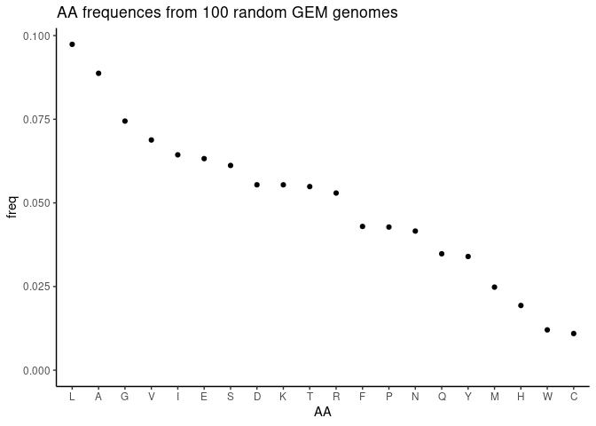
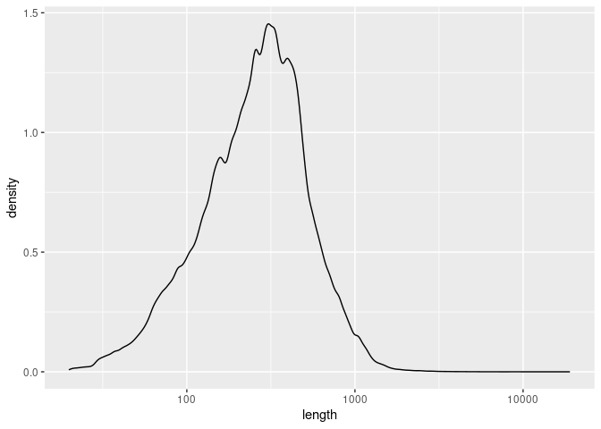

Aligning random AA sequences to SwissProt
================

Iyanu’s “Big Blast” project reveals two major peaks in the density plots
of normalized bitscores - one around 0.5, and one around 1.5. The null
hypothesis for this low-similarity peak would be that it consistent with
using BLAST (really Dimaond) to align random amino acid sequences to the
RefSeq database.

In order to test this null hypothesis, we must generate a random dataset
of amino acid sequences with comparable statistical properties to the
actual set of sequences in the GEM data set.

We could define “statistical properties” in a number of different ways,
but for simplicity let’s say that the only two important properties are:

-   sequence length
-   amino acid frequency

I have a suspicion that kmer frequency might also be important, but I
don’t know what k would be best to guess, and I don’t really know how to
generate sequences of defined k-mer frequencies, so I’m just going to
stick with sequence length and AA frequency.

``` r
library(ggplot2)
```

    ## Warning: replacing previous import 'lifecycle::last_warnings' by
    ## 'rlang::last_warnings' when loading 'tibble'

    ## Warning: replacing previous import 'lifecycle::last_warnings' by
    ## 'rlang::last_warnings' when loading 'pillar'

``` r
library(dplyr)
library(readr)
#library(glue)
```

First I need to determine the properties of the GEM genomes. I don’t
want to read all 50,000+ of them. I imagine that I can get a decent
estimate by reading 100 genomes at random.

The genomes are at `/srv/data/GEM/faa`

# Calculate amino acid frequencies

Setup:

``` r
genomes.path <- "/srv/data/GEM/faa"
AAs <- c("A", "C", "D", "E", "F", "G", "H", "I", "K", "L", "M", "N", "P", "Q", "R", "S", "T", "V", "W", "Y")
# select random genomes
set.seed(1999) # for reproducibility
rand.genome.paths <- fs::dir_ls(genomes.path) %>% sample(size = 100, replace = FALSE)
```

Amino acid frequencies are calculated as the sum of the number of amino
acids in each genome, divided by the sum of total amino acids. Thus it
is automatically weighted to the size of genomes, which I think is
appropriate.

I think the following equation describes this correctly:


where

indicated which amino acid we’re talking about,

is the number of times amino acid

appears in genome
,
and there are

genomes in the data set.

``` r
# Function to calculate AA frequencies from a filename of a faa file
calc_AA_abunds <- function(fn) {
  if(length(fn) > 1) warning("This works best when it only gets one filename at a time")
  
  seqs <- Biostrings::readAAStringSet(fn)
  
  # Calculate frequencies
  total.letter.abund <- Biostrings::letterFrequency(seqs, letters = AAs) %>% colSums()
  
  #freqs <- total.letter.abund / sum(total.letter.abund)
  
  #if(sum(freqs) < 0.99 | sum(freqs) > 1.01) warning("There's an issue with the letter frequencies; because the sum of frequencies is {sum(freqs)}.") 
  
  total.letter.abund
}

all_abunds <- lapply(rand.genome.paths, FUN = calc_AA_abunds)
all.abunds.vec <- vapply(all_abunds, FUN = identity, FUN.VALUE =  double(length = 20)) %>% rowSums()
all.freqs.vec <- all.abunds.vec / sum(all.abunds.vec)
```

Thus the overall frequency of amino acids is:

``` r
print(all.freqs.vec)
```

    ##          A          C          D          E          F          G          H 
    ## 0.08872928 0.01095621 0.05540750 0.06322785 0.04295397 0.07444650 0.01933493 
    ##          I          K          L          M          N          P          Q 
    ## 0.06436329 0.05540301 0.09738295 0.02482311 0.04157680 0.04278165 0.03478679 
    ##          R          S          T          V          W          Y 
    ## 0.05294142 0.06118628 0.05487423 0.06880309 0.01204452 0.03397662

Just for fun, let’s visualize these frequencies.

``` r
freqs_df <- data.frame(AA = names(all.freqs.vec), freq = all.freqs.vec) # There's some kind of knitr error that prevents me from piping the line above to the line below
freqs_df <- freqs_df %>% 
  mutate(AA = forcats::fct_reorder(freqs_df$AA, freqs_df$freq, .desc=TRUE))


p_freqs <- ggplot(freqs_df, aes(x=AA, y=freq)) + 
  geom_point() +
  expand_limits(ymin = 0) +
  theme_classic() + 
  ggtitle("AA frequences from 100 random GEM genomes")
print(p_freqs)
```

<!-- -->

## Calculating gene lengths

I’m taking basically the same approach to calculate gene lengths, but it
looks a bit different. I just create a vector of gene lengths for each
genome (actually `Biostrings::nchar()` does this), put all thsoe vectors
into a list, and then concatenate the list into a vector.

``` r
# I'm being lazy, so I'll just repeat this function for sequence lengths
calc_AA_lengths <- function(fn) {
  # Load fasta from a single genome
  seqs <- Biostrings::readAAStringSet(fn)
  n <- Biostrings::nchar(seqs)
  n
}

# Concatenate each genome's vector of lengths into a single vector 
# ...and calculate summary statistics
all.lengths <- lapply(rand.genome.paths, calc_AA_lengths) %>% unlist()
mean.length <- mean(all.lengths)
sd.length <- sd(all.lengths)
#total.freqs <-  apply(all.freqs, MARGIN = 1, FUN = mean)
```

The mean length is 323 +/- 243 (standard deviation).

Again, let’s visualize:

``` r
all_lengths <- data.frame(length = all.lengths)
p_length_distrib <- ggplot(all_lengths, aes(x=length)) + 
  geom_density()  +
  scale_x_log10()
print(p_length_distrib)
```

<!-- -->

The distribution looks roughly lognormal, with some skew towards the
left. (Or maybe it is normal, with some high outliers). Rather than try
to simulate this distribution parametrically, it is probably best to
just sample the distribution randomly.

# Create fictional sequences with correct summary statistics

First make a vector of `n` lengths. `n=1000` seems like a decent start.

``` r
n <- 1000

set.seed(944)
lengths <- sample(all.lengths, size = n, replace = TRUE)

# Function to create a fictional sequence of size n and AA frequency f
gen_sequence <- function(seq.length, freqs) {
  #browser()
  AAs <- names(freqs) # using names() ensures that the AA names are in the same order as their weights
  seq <- sample(AAs, size = seq.length, replace = TRUE, prob = freqs) %>% 
    paste(sep="", collapse="")
  seq
}

sim.seqs <- vapply(lengths, FUN = gen_sequence, FUN.VALUE = character(length = 1), freqs = all.freqs.vec) %>% unname()
# The names are carried over from (somewhere, I'm not sure)
```

Here are some examples of simulated sequences:

``` r
print(head(sim.seqs))
```

    ## [1] "QAQTQFDVSVATAQKASGPIFTPPKRDGCVQVLSTEAVGLGGQAQRSSNNMLWVKDGNKSINHVAVIRLPSRNTTYDSQDTAE"                                                                                                                                                                                                                                                                                         
    ## [2] "NGVITGTPSINFLNTLSIVGFTAPIVKAGINWNLGGFAPQFDVFEGGAAPLVPKNIPRYCEPRPDMTLLGAGLTTLQMRVTKARHKPKVPRPMEYWNVQLWSAYIANYKPNNLRIDGTIARAVSGIFIMRLILHSGISSLLFK"                                                                                                                                                                                                                             
    ## [3] "LAGTVFYGIADWRSEQLAKVAYYLGHVTDPCVDQHFASQPTLKYPKFAEFMSIGDNDVWSLLSYKEVTSIHMPSFANDRDSKARNRSSKLKAHPHGNFNVFSDLRDPQAALEKVLGHYKQMIHAGSIELLIKMIPRDGLSQDYPAVTAHKKVIGEAHIDLSFIKESYKWGFAKKESGGTCYYFRLVVQLARSAVVKPKMDETTENSSAHEGWMFDRAKVDDYVFPEPRPQNGRLTIWEISIQWHGAIKLLFKTDELIKALPKNSKKWETIVPTKLYEGGSSQIMRLHVKTSQTYDRFVIVFRPHMDRSDQKAQVVFLAGYGHRGIRSFLGFRTATNPGHAAIAQGVIIGLHDKEGRDLFTAPPR"
    ## [4] "GDATGDVLIAAKDGDNFLISFTEKELMVVIDKNIKTQWENITPRTALRGDGCGVSGKMGLFIGGPGVEAILRLPTLFEIDGVERSGGRDRRVIVGYIIEDPVLTEYAAIAGMEEMCSEFGKKIASVIVFPEDQIADNLSNEVEGIITLRRLKGAYSGFVPSCLVHKDRQYYKNGDFGVVTDDYLNDSSDSTLQKYQADDIYEKIDSRAAKETVIELDQGKIKGFEDDPTPRGEQVVLLCMASWI"                                                                                                                        
    ## [5] "CDSRKAKQPNFYSDDHGSAYRCMYTGAELEESFGGPRENSYREFIAFNQKPVIMILKIGMSDTVFPKTGMFRARFKESNFDMGFSVFEGLLYILDFIVGKPGGCTTPLVAVEQKELPIPAWNSAKGRFSQYVSGTYKMIINELANAGTWIAELQLGRKGLVAVSSKNKAIMTRNRVDMNAIAHADEANVVADGMQLLRAGRNQVKLNKFAGLNGQLSVNETPIEDLGTGVEGPVVKSAFENGEKSVAGGN"                                                                                                                  
    ## [6] "NTGGLKYKQKWLAGHTPAVQFTNAETTFMLAFGQLNMGKSQLKNYTDEIHTQMLGAELLMSPNSGMDSTQDGIKHDPRLDTKVNTVCYYWAVFNTLQLYQHLAHSESLGPGSCVIVRLSDDPHLASWSSGIEREVLLHISAGDNGHTIKLQEKSSAPTRFKAIHGRRHNKALASAGYYLCPETIPHRLMDASCIDARTVGIGLRIVDGTFFELELEWKTFKKALIIPVYPILLGGGMALV"

## Save as fasta

``` r
sim_seqs <- Biostrings::AAStringSet(sim.seqs)
Biostrings::writeXStringSet(sim_seqs, 
                            "simulated_sequences.fasta",
                            format="fasta")
```

# diamond search against RefSeq database

The next step is to do a diamond search against the refseq database.
Ideally this is done inside this notebook, for consistency, but I don’t
know where the relevant files are located.
